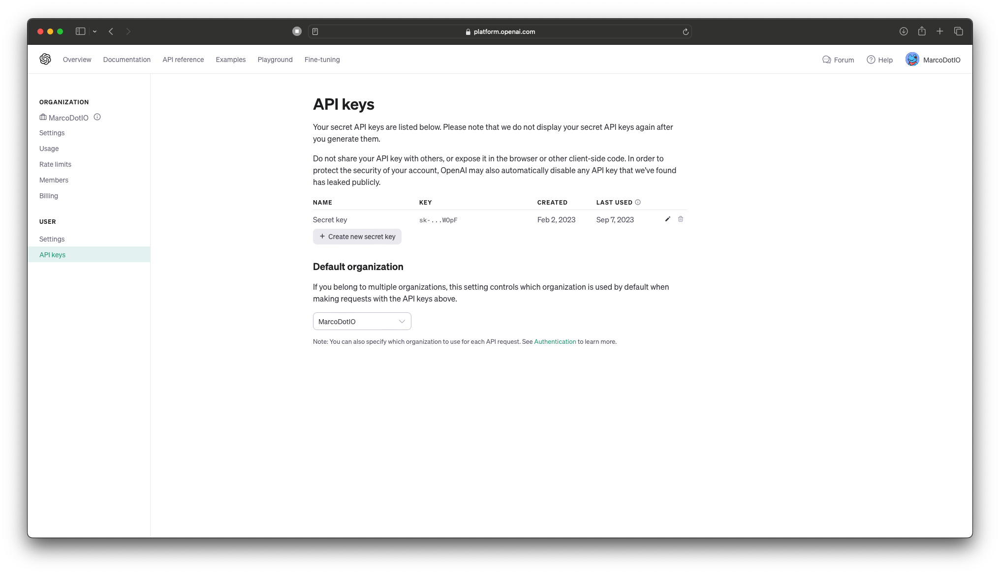

[](https://swiftpackageindex.com/OpenDive/OpenAIKit)
[](https://swiftpackageindex.com/OpenDive/OpenAIKit)
[](https://img.shields.io/badge/Swift_Package_Manager-compatible-orange?style=flat-square)
[](https://github.com/OpenDive/OpenAIKit/actions/workflows/swift.yml)
[](https://twitter.com/OpenDiveHQ)

<div align="center">
  <a href="https://github.com/OpenDive/OpenAIKit">
     
  </a>
  <h3 align="center">OpenAIKit</h3>
  <p align="center">
  A community-maintained Swift SDK for the OpenAI API.
  <br />
  <br />
     <a href="https://github.com/OpenDive/OpenAIKit/issues">Report Bug</a>
  ·
     <a href="https://github.com/OpenDive/OpenAIKit/issues">Request Feature</a>
 </p>
</div>


## Table of Contents

- [About the Project](#about-the-project)
  - [Motivation](#motivation)
  - [Our Vision](#our-vision)
- [Features](#features)
- [Requirements](#requirements)
- [Installation](#installation)
  - [Swift Package Manager](#swift-package-manager)
    - [SPM Through Xcode Project](#spm-through-xcode-project)
    - [SPM Through Xcode Package](#spm-through-xcode-package)
- [Using OpenAIKit](#using-openaikit)
  - [Obtaining API Keys](#obtaining-api-keys)
  - [Image](#image)
  - [Chat](#chat)
  - [Audio](#audio)
  - [Utilities](#utilities)
    - [Embeddings](#embeddings)
    - [Models](#models)
  - [Completion](#completion)
  - [Migration From 1.x to 2.0](#migration-from-1.x-to-2.0)
- [Example Projects](#example-projects)
- [Development and Testing](#development-and-testing)
- [Credits](#credits)
- [License](#license)

## About the Project

**OpenAIKit** is a community-driven Swift SDK designed to provide Swift developers with a seamless, efficient, and Swifty way to interact with the OpenAI REST endpoint. Our aim is to lower the barrier for Swift developers, enabling them to integrate the power of OpenAI into their apps without delving deep into the intricacies of RESTful services.

### Motivation

With the increasing demand for AI-powered features in modern applications, it's crucial for developers to have access to tools that simplify the integration process. While OpenAI offers an incredible suite of capabilities, there was a clear need for a dedicated Swift SDK that aligns with the idiomatic practices of the language and the expectations of the Swift developer community.

### Our Vision

We envisioned a tool that not only provides raw access to OpenAI functionalities but also enhances the developer experience with a clear and intuitive API. Our ultimate goal is to foster innovation by providing the Swift community with the right tools to integrate AI capabilities into their applications effortlessly.

## Features

- [x] Generate new, edited, and variations of images using Dall-E 2 (with Dall-E 3 coming soon).
- [x] Generate edits and completions using GPT-3 and GPT-4.
- [x] List avaiable models for use with GPT-3 and GPT-4.
- [x] Retrieve embeddings for GPT-3 and GPT-4 prompts.
- [x] Stream data for GPT-3 and GPT-4 completions.
- [x] Generate Chat responses using ChatGPT.
- [x] View and Upload training files.
- [x] View whether a prompt is flagged by the Moderations endpoint or not.
- [x] Comprehensive Unit and Integration Test coverage.
- [x] Swift Concurrency compatibility back to iOS 13, macOS 10.15, tvOS 13, watchOS 6, and visionOS 1.0.
- [x] Complete documentation of OpenAIKit.

## Requirements

| Platform                                                     | Minimum Swift Version | Installation                                    | Status       |
| ------------------------------------------------------------ | --------------------- | ----------------------------------------------- | ------------ |
| iOS 13.0+ / macOS 10.15+ / tvOS 13.0+ / watchOS 6.0+ / visionOS 1.0+ | 5.7                   | [Swift Package Manager](#swift-package-manager) | Fully Tested |

## Installation

### Swift Package Manager

The [Swift Package Manager](https://swift.org/package-manager/) allows for developers to easily integrate packages into their Xcode projects and packages; and is also fully integrated into the `swift` compiler.

#### SPM Through XCode Project

* File > Swift Packages > Add Package Dependency
* Add `https://github.com/OpenDive/OpenAIKit.git`
* Select "Up to next Major" with "2.0"

#### SPM Through Xcode Package

Once you have your Swift package set up, add the Git link within the `dependencies` value of your `Package.swift` file.

```swift
dependencies: [
    .package(url: "https://github.com/OpenDive/OpenAIKit.git", .upToNextMajor(from: "2.0"))
]
```

## Using OpenAIKit

### Obtaining API Keys

To obtain an API Key, go to your `API Keys` page on your account page [here](https://platform.openai.com/account/api-keys).



> ## ⚠️ 🔑 **Important: Do Not Store OpenAI API Keys Directly in Code!** 🔑⚠️
>
> When working with OpenAI's API, it's essential for security reasons not to embed your API keys directly within the codebase of your application. Embedding keys directly in your source code can expose them to unauthorized users and malicious actors, leading to potential misuse.
>
> **Best Practices:**
>
> 1. **Environment Variables:** Store your API keys in environment variables and access them in your code. This way, they aren't hard-coded into your application and can be managed securely.
> 2. **Secrets Management:** Use a secure secrets management tool or service to store and retrieve your API keys. Tools like AWS Secrets Manager, HashiCorp Vault, Firebase, CloudKit, or Azure Key Vault are designed to store, manage, and retrieve sensitive data. This way, the user does not have on-device access to the keys.
> 3. **.gitignore:** If you store your API keys in a configuration file, always ensure that this file is added to `.gitignore` or a similar mechanism to prevent it from being accidentally committed to a source control system.
> 4. **Regularly Rotate Keys:** Rotate your API keys periodically to mitigate the potential impact of a leak.
>
> Remember, security is of utmost importance. Always prioritize the safe handling of sensitive information like API keys!
>
> For more information, check out [this article](https://nshipster.com/secrets/) all about API key management for Swift developers.


### Image

Dive into the next evolution of AI-powered image generation with DALL-E 2 (and coming soon, DALL-E 3), brought to you by OpenAI. Building upon the legacy of its predecessor, DALL-E 2 offers enhanced capabilities to materialize intricate visuals from textual prompts, creating a seamless bridge between language and imagery. Developers can harness this groundbreaking technology to enrich user experiences, craft dynamic content, and inspire new avenues of creativity. Revolutionize your applications and projects by integrating the cutting-edge power of DALL-E 2.

There are three endpoints provided by OpenAI to interact with DALL-E 2:
    - `createImage` is the main endpoint that allows direct image generation from a text prompt. Here's an example on how to use the endpoint, along with the correlating output:

```swift
do {
    let imageParam = ImageParameters(
        // A text description of the desired image(s).
        prompt: "An armchair in the shape of an avocado",
        // The size of the generated images.
        resolution: .large,
        // The format in which the generated images are returned.
        responseFormat: .base64Json
    )
    let result = try await openAi.createImage(
        parameters: imageParam
    )
    let b64Image = result.data[0].image
    let image = try openAi.decodeBase64Image(b64Image)
} catch {
    // Insert your own error handling method here.
}
```

​	
​    - `createImageEdit` allows the developer to create edits based on the original image inputted, along with a transparent-enabled image, with the transparent portions being the areas to edit in; and a prompt of the original image with the edit the developer wants. Here's an example on how to use the endpoint, along with the correlating output:

```swift
do {
    let imageEditParam = try ImageEditParameters(
        // The image to edit.
        image: image,
        // An additional image whose fully transparent areas indicate where image should be edited.
        mask: mask,
        // A text description of the desired image(s).
        prompt: "The Mona Lisa wearing a beret, in the style of Leonardo DaVinci",
        // The size of the generated images.
        resolution: .large,
        // The format in which the generated images are returned.
        responseFormat: .base64Json
    )

    let imageResponse = try await openAI.generateImageEdits(
        parameters: imageEditParam
    )

    let image = try openAI.decodeBase64Image(imageResponse.data[0].image)
} catch {
    // Insert your own error handling method here.
}
```
|  |  |  |
|-----------------------|---------------------------|---------------------------------|
| **Original** | **Mask** | **Edit** |   

​	- `createImageVariation` allows the developer to create variations of a given input image. Here's an example on how to use the endpoint, along with the correlating output:
```swift
do {
    let imageVariationParam = try ImageVariationParameters(
        // The image to use as the basis for the variation(s).
        image: image,
        // The size of the generated images.
        resolution: .large,
        // The format in which the generated images are returned.
        responseFormat: .base64Json
    )

    let variationResponse = try await openAI.generateImageVariations(
        parameters: imageVariationParam
    )

    self.image = try openAI.decodeBase64Image(
        variationResponse.data[0].image
    )
} catch {
    // Insert your own error handling method here.
}
```
|  |  |
|-----------------------|---------------------------------|
| **Original** | **Variation** |   

### Chat

ChatGPT, built on OpenAI's GPT-4 architecture, is a cutting-edge conversational AI model. It provides developers with a robust tool for integrating advanced natural language processing capabilities into applications. Using ChatGPT can enhance user interactions, improve efficiency, and offer AI-driven solutions in various use cases. Incorporate GPT-4's strength into your projects for tangible results.

There is a single endpoint for this feature, however, this SDK splits the endpoint into two functions with three separate features in total:
    - `generateChatCompletion` allows the developer to generate chat completions using the provided models from OpenAI; or the developer's owned fine tuned models. Here's an example on how to use the endpoint, along with the correlating output:
```swift
do {
    let chat: [ChatMessage] = [
        ChatMessage(role: .system, content: "You are a helpful assistant."),
        ChatMessage(role: .user, content: "Who won the world series in 2020?"),
        ChatMessage(role: .assistant, content: "The Los Angeles Dodgers won the World Series in 2020."),
        ChatMessage(role: .user, content: "Where was it played?")
    ]

    let chatParameters = ChatParameters(
        model: .gpt4,  // ID of the model to use.
        messages: chat  // A list of messages comprising the conversation so far.
    )

    let chatCompletion = try await openAI.generateChatCompletion(
        parameters: chatParameters
    )

    if let message = chatCompletion.choices[0].message {
        let content = message.content
    }
} catch {
    // Insert your own error handling method here.
}
```
```
ChatResponse(
    id: "chatcmpl-88eG5VruffcNHPNVGBKGVAV5HGk4j", 
    object: OpenAIKit.OpenAIObject.chatCompletion, 
    created: 1697072069, 
    choices: [
        OpenAIKit.ChatChoice(
            message: Optional(
                OpenAIKit.ChatMessage(
                    id: "250FDA2D-2F38-4E6F-B97E-DAD74FED1FB6", 
                    role: OpenAIKit.ChatRole.assistant, 
                    content: Optional(
                        "The 2020 World Series was played at Globe Life Field in Arlington, Texas."
                    ), 
                    functionCall: nil
                )
            ), 
            delta: nil, 
            index: 0, 
            logprobs: nil, 
            finishReason: Optional("stop")
        )
    ], 
    usage: Optional(
        OpenAIKit.Usage(
            promptTokens: 53, 
            completionTokens: 17, 
            totalTokens: 70
        )
    )
)
```
The developer is also able to use function calls to execute various functions (i.e., fetching weather info, uploading files, etc). Here's an example on how to use the parameter, the corresponding response, and example usage with a local function.
```swift
do {
    let functions: [Function] = [
        Function(
            name: "getCurrentWeather",
            description: "Get the current weather in a given location",
            parameters: Parameters(
                type: "object",
                properties: [
                    "location": ParameterDetail(
                        type: "string", 
                        description: "The city and state, e.g. San Francisco, CA"
                    ),
                    "unit": ParameterDetail(
                        type: "string", enumValues: ["fahrenheit", "celsius"]
                    )
                ],
                required: ["location"]
            )
        )
    ]
    let messages: [ChatMessage] = [
        ChatMessage(role: .user, content: "What's the weather like in Boston?")
    ]

    let chatParameters = ChatParameters(
        model: .gpt4,  // ID of the model to use.
        messages: messages,  // A list of messages comprising the conversation so far.
        functionCall: "auto",  // Controls how the model calls functions.
        functions: functions  // A list of functions the model may generate JSON inputs for.
    )

    let chatCompletion = try await openAI.generateChatCompletion(
        parameters: chatParameters
    )
} catch {
    // Insert your own error handling method here.
}
```
```
ChatResponse(
    id: "chatcmpl-88eVjsHEPtDDiSEuCexsqO8iuhnfG", 
    object: OpenAIKit.OpenAIObject.chatCompletion, 
    created: 1697073039, 
    choices: [
        OpenAIKit.ChatChoice(
            message: Optional(
                OpenAIKit.ChatMessage(
                    id: "DCE5EECB-9521-481D-9E75-C7FF9390E4CF", 
                    role: OpenAIKit.ChatRole.assistant, 
                    content: nil, 
                    functionCall: Optional(
                        OpenAIKit.FunctionCall(
                            arguments: "{\n\"location\": \"Boston, MA\"\n}", 
                            name: "getCurrentWeather"
                        )
                    )
                )
            ), 
            delta: nil, 
            index: 0, 
            logprobs: nil, 
            finishReason: Optional("function_call")
        )
    ], 
    usage: Optional(OpenAIKit.Usage(promptTokens: 81, completionTokens: 16, totalTokens: 97))
)
```
```swift
func getCurrentWeather(location: String, unit: TemperatureUnit = .fahrenheit) -> WeatherInfo {
    return WeatherInfo(location: location, temperature: "72", unit: unit, forecast: ["sunny", "windy"])
}

if let message = chatCompletion.choices[0].message, let functionCall = message.functionCall {
    let jsonString = functionCall.arguments
    if let data = jsonString.data(using: .utf8) {
        do {
            if 
                let json = try JSONSerialization.jsonObject(with: data, options: []) as? [String: Any],
                let location = json["location"] as? String
            {
                self.weatherInfo = self.getCurrentWeather(location: location)
            }
        } catch {
            // Insert your own error handling method here.
        }
    }
}
```

​	- `generateChatCompletionStreaming` allows the developr to stream chat completion data from the endpoint. Here's an example on how to use the endpoint, along with the correlating output:
```swift
do {
    let chat: [ChatMessage] = [
        ChatMessage(role: .system, content: "You are a helpful assistant."),
        ChatMessage(role: .user, content: "Who won the world series in 2020?"),
        ChatMessage(role: .assistant, content: "The Los Angeles Dodgers won the World Series in 2020."),
        ChatMessage(role: .user, content: "Where was it played?")
    ]
    
    let chatParameters = ChatParameters(model: .chatGPTTurbo, messages: chat)

    let stream = try openAI.generateChatCompletionStreaming(
        parameters: chatParameters
    )
} catch {
    // Insert your own error handling method here.
}
```
```
ChatResponse(
    id: "chatcmpl-88enklY0vmc4fNkM1mJQCkzW6hcST", 
    object: OpenAIKit.OpenAIObject.chatCompletionChunk, 
    created: 1697074156, 
    choices: [
        OpenAIKit.ChatChoice(
            message: nil, 
            delta: Optional(
                OpenAIKit.ChatDelta(
                    role: Optional(OpenAIKit.ChatRole.assistant), 
                    content: Optional("")
                )
            ), 
            index: 0, 
            logprobs: nil, 
            finishReason: nil
        )
    ], 
    usage: nil
)
ChatResponse(
    id: "chatcmpl-88enklY0vmc4fNkM1mJQCkzW6hcST", 
    object: OpenAIKit.OpenAIObject.chatCompletionChunk, 
    created: 1697074156, 
    choices: [
        OpenAIKit.ChatChoice(
            message: nil, 
            delta: Optional(
                OpenAIKit.ChatDelta(
                    role: nil, 
                    content: Optional("The")
                )
            ), 
            index: 0, 
            logprobs: nil, 
            finishReason: nil
        )
    ],
    usage: nil
)

// ...

ChatResponse(
    id: "chatcmpl-88enklY0vmc4fNkM1mJQCkzW6hcST", 
    object: OpenAIKit.OpenAIObject.chatCompletionChunk, 
    created: 1697074156, 
    choices: [
        OpenAIKit.ChatChoice(
            message: nil, 
            delta: Optional(
                OpenAIKit.ChatDelta(
                    role: nil, 
                    content: Optional(".")
                )
            ), 
            index: 0, 
            logprobs: nil, 
            finishReason: nil
        )
    ], 
    usage: nil
)
ChatResponse(
    id: "chatcmpl-88enklY0vmc4fNkM1mJQCkzW6hcST", 
    object: OpenAIKit.OpenAIObject.chatCompletionChunk, 
    created: 1697074156, 
    choices: [
        OpenAIKit.ChatChoice(
            message: nil, 
            delta: Optional(
                OpenAIKit.ChatDelta(
                    role: nil, 
                    content: nil
                )
            ), 
            index: 0, 
            logprobs: nil, 
            finishReason: Optional("stop")
        )
    ], 
    usage: nil
)
```

### Audio

Whisper is OpenAI's speech-to-text AI model, designed for accurate transcription of spoken content. By converting audio into text, it offers developers a straightforward tool for tasks like transcription services, voice commands, vocal language translations, or audio indexing. Implementing Whisper can help streamline processes, make applications more accessible, and leverage voice data efficiently.

There are the two main endpoints that use the Whisper model:
    - `createTranscription` is the main endpoint that allows developers to transcribe spoken audio into text. Here's an example on how to use the endpoint, and the corresponding returned item:

```swift
do {
    let audioParameters = TranscriptionParameters(file: audio)
    
    let transcriptionCompletion = try await openAI.createTranscription(parameters: audioParameters)
} catch {
    // Insert your own error handling method here.
}
```

<audio controls>
    <source src="Resources/InputTranscriptionAudio.mp3" type="audio/mpeg">
Your browser does not support the audio element.
</audio>

```
Arousing from the most profound of slumbers, we break the gossamer web of some dream. Yet in a second afterward, so frail may that web have been, we remember not that we have dreamed. In the return to life 
from the swoon there are two stages, first, that of the sense of mental or spiritual, secondly, that of the sense of physical existence. It seems probable that if, upon reaching the second stage, we could 
recall the impressions of the first, we should find these impressions eloquent in memories of the gulf beyond. And that gulf is what? How at least shall we distinguish its shadows from those of the tomb?
```

​	- `createTranslation` is the second endpoint that allows developers to translate any non-English audio into transcribed English text. Here's an example on how to use the endpoint, and the corresponding returned item:

```swift
do {
    let audioParameters = TranscriptionParameters(file: audio)
    
    let transcriptionCompletion = try await openAI.createTranslation(parameters: audioParameters)
} catch {
    // Insert your own error handling method here.
}
```

<audio controls>
    <source src="Resources/InputTranslationAudio.mp3" type="audio/mpeg">
Your browser does not support the audio element.
</audio>

```
In the night, when I was out of my mind, and I, pained, numb and tired, thought about the beauty and goodness of a long-forgotten lesson, and my head began to shake, I suddenly heard something tick that scared 
me out of my sleep. Who could it be in that weather? A visitor is knocking, I thought, at my room in that weather. That's all it is, and nothing more.
```

### Utilities

#### Embeddings

Embeddings utilize OpenAI's GPT models to generate dense vector representations for text. These embeddings capture semantic information, enabling developers to perform tasks like similarity search, clustering, or fine-tuning on specific tasks. By integrating GPT Embeddings into applications, developers can enhance text analysis and retrieval capabilities, leading to more effective data processing and insights.

Here's an example on how to use it, and the expected output for the endpoint:

```swift
do {
    let embeddingsParam = EmbeddingsParameters(model: "text-similarity-ada-002", input: input)

    self.embeddingsResponse = try await openAI.createEmbeddings(parameters: embeddingsParam)
} catch {
    // Insert your own error handling method here.
}
```
```
OpenAIKit.EmbeddingsResponse(
    object: OpenAIKit.OpenAIObject.list, 
    data: [
        OpenAIKit.EmbeddingsData(
            object: OpenAIKit.OpenAIObject.embedding, 
            embedding: [
                0.0028667077, 
                0.018867997, 
                -0.030135695,
                // ...
                -0.004177677, 
                -0.015615467, 
                -0.008131327
            ], 
            index: 0
        )
    ], 
    model: "text-similarity-ada:002", 
    usage: OpenAIKit.EmbeddingsUsage(
        promptTokens: 8, 
        totalTokens: 8
    )
)
```

#### Models

The models endpoint allows developers to fetch the currently available models from OpenAI, along with their own fine-tuned models.

There are two endpoints available for use with this feature:
- `listModels` fetches the entire list of models avaialbe to the developer. Here's an example usage, along with the corresponding output:

```swift
do {
    let modelsResponse = try await openAi.listModels()
} catch {
    // Insert your own error handling method here.
}
```
```
ListModelResponse(
    object: OpenAIKit.OpenAIObject.list, 
    data: [
        OpenAIKit.Model(
            id: "text-search-babbage-doc-001", 
            object: OpenAIKit.OpenAIObject.model, 
            created: 1651172509, 
            ownedBy: "openai-dev"
        ), 
        OpenAIKit.Model(
            id: "curie-search-query", 
            object: OpenAIKit.OpenAIObject.model, 
            created: 1651172509, 
            ownedBy: "openai-dev"
        ), 
        OpenAIKit.Model(
            id: "text-search-babbage-query-001", 
            object: OpenAIKit.OpenAIObject.model, 
            created: 1651172509, 
            ownedBy: "openai-dev"
        ), 
        OpenAIKit.Model(
            id: "babbage", 
            object: OpenAIKit.OpenAIObject.model, 
            created: 1649358449, 
            ownedBy: "openai"
        ), 
        OpenAIKit.Model(
            id: "gpt-3.5-turbo-instruct-0914", 
            object: OpenAIKit.OpenAIObject.model, 
            created: 1694122472, 
            ownedBy: "system"
        )
        // ...
    ]
)
```

- `retrieveModels` fetches a single model, given the input model's ID. Here's an example usage, along with the corresponding output:

```swift
do {
    let model = try await openAI.retrieveModel(modelId: "text-davinci-001")
} catch {
    // Insert your own error handling method here.
}
```
```
OpenAIKit.Model(
    id: "text-davinci-001", 
    object: OpenAIKit.OpenAIObject.model, 
    created: 1649364042, 
    ownedBy: "openai"
)
```

### Completion

#### ⚠️ Deprecation Notice for Completion API ⚠️

As of July 6, 2023, OpenAI has announced the deprecation of the older models in the Completions API, which are set to retire at the beginning of 2024. It's highly recommended to transition to the Chat Completions API which provides a more structured prompt interface and multi-turn conversation capabilities. The Chat Completions API has proven to handle a vast majority of previous use cases and new conversational needs with higher flexibility and specificity, significantly enhancing the developer experience. For more details, refer to the [official announcement](https://openai.com/blog/gpt-4-api-general-availability).

### Migration From 1.x to 2.0

As of 2.0, Chat Completion Models use enums to label each available model for the main usage of default models. Here is an example on how to migrate from using the older initializer for `ChatParameter` to the initializer for 2.0:

```swift
// ❌ 1.x implementation
let chatParameters = ChatParameters(model: "gpt4", messages: chat)

// ✅ 2.0 implementation
let chatParameters = ChatParameters(model: .gpt4, messages: chat)
```

If you need a custom string for fine-tuned models, use the `customModel` parameter:

```swift
// ✅ 2.0 implementation for custom model IDs
let chatParameters = ChatParameters(customModel: "INSERT-MODEL-ID", message: chat)
```

## Example Projects

(TBD)

## Development And Testing

I welcome anyone to contribute to the project through posting issues, if they encounter any bugs / glitches while using OpenAIKit; and as well with creating pull issues that add any additional features to OpenAIKit.

## Credits

I would like to personally thank the [OpenAI Team](https://openai.com) for implementing the API endpoint and implementing the models themselves, as without them, this project wouldn't have been possible. 

As well, I would like to personally thank [YufeiG](https://github.com/YufeiG) for providing troubleshooting help on sending Image data for the Image Edit and Variations endpoints.

## License

OpenAIKit is released under the MIT license, and any use of OpenAI's REST endpoint will be under the [Usage policies](https://beta.openai.com/docs/usage-policies) set by them.

```
Permission is hereby granted, free of charge, to any person obtaining a copy
of this software and associated documentation files (the "Software"), to deal
in the Software without restriction, including without limitation the rights
to use, copy, modify, merge, publish, distribute, sublicense, and/or sell
copies of the Software, and to permit persons to whom the Software is
furnished to do so, subject to the following conditions:

The above copyright notice and this permission notice shall be included in
all copies or substantial portions of the Software.

THE SOFTWARE IS PROVIDED "AS IS", WITHOUT WARRANTY OF ANY KIND, EXPRESS OR
IMPLIED, INCLUDING BUT NOT LIMITED TO THE WARRANTIES OF MERCHANTABILITY,
FITNESS FOR A PARTICULAR PURPOSE AND NONINFRINGEMENT. IN NO EVENT SHALL THE
AUTHORS OR COPYRIGHT HOLDERS BE LIABLE FOR ANY CLAIM, DAMAGES OR OTHER
LIABILITY, WHETHER IN AN ACTION OF CONTRACT, TORT OR OTHERWISE, ARISING FROM,
OUT OF OR IN CONNECTION WITH THE SOFTWARE OR THE USE OR OTHER DEALINGS IN
THE SOFTWARE.
```
